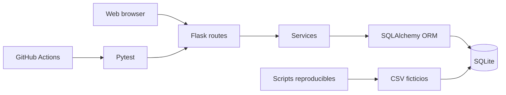

Contoso Customer Portal

> Repositorio de demostración para cursos **GitHub Foundations GH-900**. Todos los datos, empresas, correos, teléfonos, direcciones, órdenes e incidentes son completamente ficticios.

## Objetivos didácticos GH-900

Este proyecto permite practicar Git vs GitHub, repositorios, commits, branches, GitHub Flow, pull requests, code reviews, conflictos, Issues, labels, milestones, Projects, Markdown, Actions, Codespaces, Pages, releases, tags, Dependabot, CodeQL, seguridad conceptual y GitHub Copilot en modos Ask, Edit y Agent.

## Arquitectura

Aplicación Flask con SQLite y SQLAlchemy. Las rutas HTTP viven en `app/routes.py`, la lógica de negocio en `app/services.py`, los modelos en `app/models.py`, los datos semilla en `data/` y las guías del curso en `docs/`.



## Estructura del repositorio

```text
.devcontainer/        Configuración para Codespaces
.github/              Workflows, templates, Dependabot, CODEOWNERS y Copilot
app/                 Aplicación Flask, plantillas y assets
data/                 CSV ficticios reproducibles
docs/                 Guías GH-900 y material del instructor
scripts/              Generación de datos e inicialización SQLite
tests/                Pruebas unitarias Pytest
```

> Nota: el directorio real es `app/`; la separación anterior evita que algunos renderizadores confundan rutas durante presentaciones.

## Requisitos previos

- Python 3.12
- Git
- Navegador web
- Cuenta de GitHub para funciones como PRs, Actions, Projects, Pages y Copilot según licencia/configuración disponible

## Instalación

### Windows PowerShell

```powershell
py -3.12 -m venv .venv
.\.venv\Scripts\Activate.ps1
pip install -r requirements.txt
python scripts/demo_setup.py
python run.py
```

### macOS y Linux

```bash
python3.12 -m venv .venv
source .venv/bin/activate
pip install -r requirements.txt
python scripts/demo_setup.py
python run.py
```

### GitHub Codespaces

Abre el repositorio en Codespaces. El `postCreateCommand` instala dependencias y prepara datos. Ejecuta `python run.py` y abre el puerto 5000.

## Pruebas y linting

```bash
ruff check .
pytest -q
```

## Uso básico de la API

```bash
curl http://127.0.0.1:5000/health
curl http://127.0.0.1:5000/api/customers
curl "http://127.0.0.1:5000/api/customers/search?q=contoso"
curl -X POST http://127.0.0.1:5000/api/orders   -H "Content-Type: application/json"   -d '{"customer_id":1,"product_id":1,"quantity":2}'
```

Las respuestas JSON usan el formato `{success, message, data, errors}` y códigos HTTP apropiados.

## GitHub Flow, Issues y Pull Requests

1. Crea un Issue con criterios de aceptación.
2. Crea una branch corta: `feature/customer-search`.
3. Realiza commits pequeños y descriptivos.
4. Abre un pull request, vincula el Issue y solicita revisión.
5. Espera checks de Actions, resuelve comentarios y haz merge.

## GitHub Actions, Dependabot y CodeQL

- `ci.yml`: instala Python 3.12, dependencias, ejecuta Ruff y Pytest.
- `codeql.yml`: análisis estático Python en push, PR y programación semanal.
- `pages.yml`: publica documentación estática si Pages está configurado para GitHub Actions.
- `release.yml`: crea un artefacto ZIP cuando se publica un tag `v*`.
- `dependabot.yml`: revisa dependencias Python y GitHub Actions semanalmente.

Algunas funciones dependen de permisos, configuración de repositorio, organización o licencia.

## Seguridad

No almacenes credenciales. Usa variables de entorno y `.env.example` como referencia sin secretos. SQLAlchemy evita SQL Injection al construir consultas. Secret scanning y push protection se documentan de forma conceptual sin incluir secretos reales.

## Contribuir, roadmap y licencia

Consulta `CONTRIBUTING.md`, `docs/roadmap.md`, `SECURITY.md`, `SUPPORT.md` y `LICENSE`.

## Tabla GH-900

| Elemento | Objetivo GH-900 |
| --- | --- |
| README y docs | Markdown, documentación y arquitectura |
| `.github/ISSUE_TEMPLATE` | Issues, labels y buenas prácticas |
| Branch scenarios en docs | Branches, GitHub Flow y PRs |
| Tests y Ruff | Validación, CI y calidad |
| Workflows | GitHub Actions, CodeQL, Pages y releases |
| Dev Container | GitHub Codespaces |
| Dependabot | Seguridad de dependencias |
| Copilot instructions/prompts | Copilot Ask, Edit, Agent y Chat |
| SECURITY.md | Vulnerabilidades, secret scanning y push protection conceptual |
| CHANGELOG y release workflow | Tags, releases y versionado |
