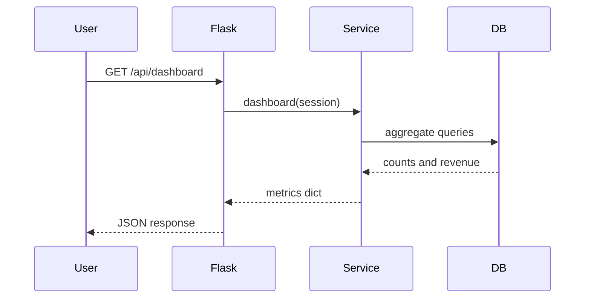

# Arquitectura

El portal usa una arquitectura de tres capas fácil de explicar: presentación con Flask templates, API con rutas Flask y servicios Python, y persistencia SQLite mediante SQLAlchemy ORM. Esta separación ayuda a demostrar refactorización, pruebas unitarias y code review.

## Componentes

- `app/routes.py`: endpoints HTML y JSON.
- `app/services.py`: validación, búsquedas, creación de órdenes y métricas.
- `app/models.py`: entidades Customer, Product, Order y SupportTicket.
- `scripts/`: generación de CSV e inicialización de la base de datos.

